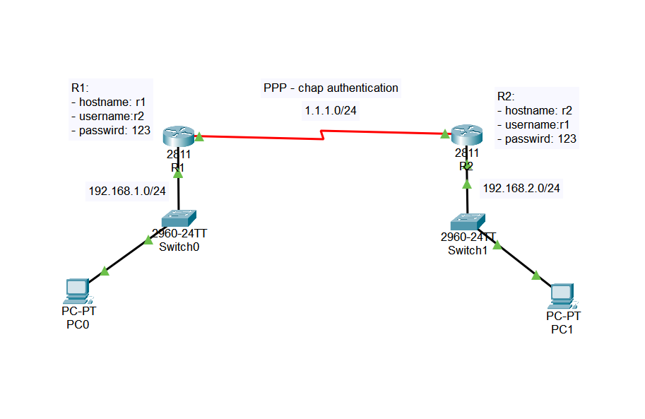

# PPP CHAP Authentication Lab

> **Author:** Amirhossein Tavakoli
> **Tool:** Cisco Packet Tracer
> **Level:** Intermediate

---

## 📋 Overview

This lab demonstrates secure point-to-point communication using PPP (Point-to-Point Protocol) with CHAP (Challenge Handshake Authentication Protocol). Two Cisco routers authenticate each other before establishing the serial connection, providing a more secure alternative to HDLC.

---

## 🖧 Topology



---

## 🎯 Objectives

- Configure PPP encapsulation
- Configure CHAP authentication
- Configure router hostnames
- Configure local usernames and passwords
- Verify successful PPP authentication
- Test end-to-end connectivity

---

## 🔧 Devices Used

| Device | Model | Role |
|--------|-------|------|
| R1 | Cisco 2811 | PPP Router |
| R2 | Cisco 2811 | PPP Router |
| Switch0 | Cisco 2960 | LAN Switch |
| Switch1 | Cisco 2960 | LAN Switch |
| PC0 | PC-PT | Client |
| PC1 | PC-PT | Client |

---

## ⚙️ Key Configurations

### PPP Configuration

```bash
Router(config)# interface Serial0/0/0
Router(config-if)# encapsulation ppp
Router(config-if)# ppp authentication chap
```

### CHAP Authentication

```bash
Router(config)# hostname R1
Router(config)# username R2 password 123
```

---

## ✅ Verification Commands

```bash
Router# show interfaces serial 0/0/0
Router# show running-config
Router# show ppp all
Router# ping 192.168.2.1
```

---

## 🌐 Network Addressing

| Network | Purpose |
|---------|---------|
| 192.168.1.0/24 | LAN 1 |
| 1.1.1.0/24 | PPP Serial Link |
| 192.168.2.0/24 | LAN 2 |

---

## 📁 Files

| File | Description |
|------|-------------|
| `ppp-chap-lab.pkt` | Cisco Packet Tracer project |
| `topology.png` | Network topology |

---

## 📚 Concepts Covered

- PPP
- CHAP Authentication
- Serial Interfaces
- WAN Technologies
- Secure Router Authentication
